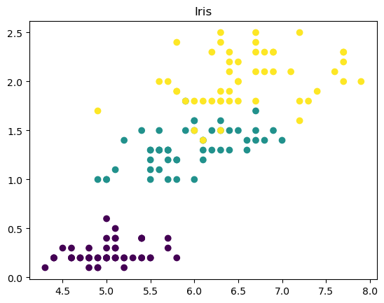
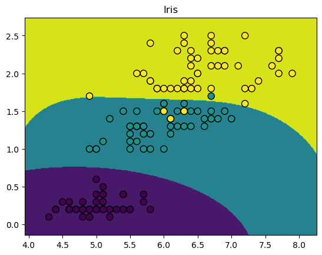

<h1> Análise e Classificação de Flores Iris com Support Vector Machine (SVM)</h1>

<h2>Este código utiliza a biblioteca scikit-learn para realizar a classificação de flores Iris usando o algoritmo de Máquina de Vetores de Suporte (SVM). A análise é feita utilizando o algoritmo Support Vector Machine (SVM), um modelo de aprendizado de máquina para classificação e regressão.</h2>
<ol>
 <li> Carregamento dos Dados:
    
Utiliza o conjunto de dados Iris fornecido pela scikit-learn.

    
Cria um DataFrame chamado iris com as características (features) e os rótulos (targets).

 </li>
  <li>Apresentação Inicial da Base de Dados:
    
Exibe os primeiros 5 indivíduos da base de dados usando iris.head().

  </li>
  <li>Estatísticas Básicas da Base de Dados:
    
Fornece algumas estatísticas básicas da base de dados, como médias, mínimos e máximos de cada coluna, usando iris.describe(). 

  </li>
  <li> Informações Detalhadas da Base de Dados:
    
Apresenta informações detalhadas sobre a base, como o tipo de cada coluna, a memória ocupada e outras informações relevantes, usando iris.info().

  </li>

  <li> Treinamento do Modelo SVM:
    
Importa o algoritmo de Máquina de Vetores de Suporte (SVC) da scikit-learn.

    
Configura o modelo SVC com um kernel automático (gamma="auto").

     
Utiliza validação cruzada (cross_val_score) para avaliar a acurácia do modelo.

  </li>
  <li> Avaliação do Modelo:
    
Exibe a acurácia média do modelo com validação cruzada.

  </li>
  <li> Treinamento Final do Modelo:
    
Treina o modelo SVC com todos os dados disponíveis.

  </li>
<<<<<<< HEAD

=======
>>>>>>> 72a5559fa8dbce0051bc9fcb47e1782be29e8d83
  <li> Predição de uma Nova Instância:
   
 Prediz a qual classe pertencerá uma flor com características específicas usando svc.predict().

  </li>
  <li> Visualização da Decisão do Modelo:
    
Cria um gráfico de dispersão (scatter plot) e um contorno de decisão para visualizar como o modelo SVM separa as classes com base nas características 'sepal length' e 'petal width'.

  </li>

</ol>

Esse código fornece uma introdução básica à classificação de flores Iris usando SVM e oferece uma visualização da decisão do modelo no espaço de características.

